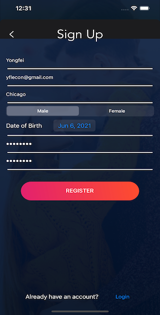
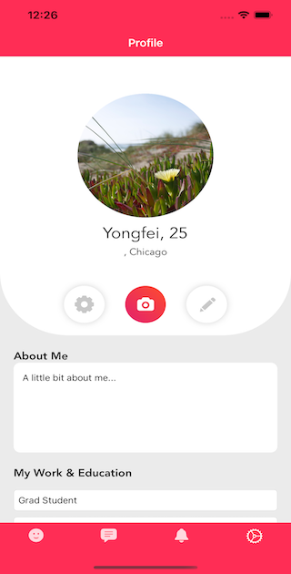
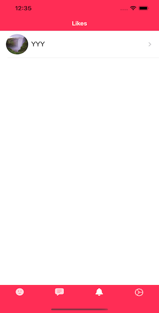
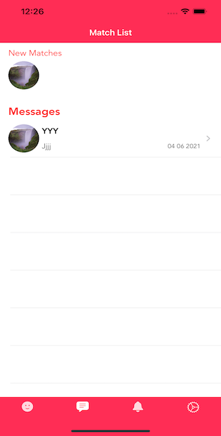
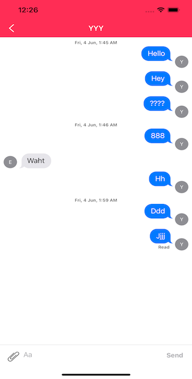

# Dating App
### Author: Yongfei Lu   
### Date: June 5th, 2021

## Third-Party Framework:
	In this app, we use Cocoapods to incorporate Firebase related frameworks, along with Gallery, 
	NVActivityIndicatorView/AppExtension, ProgressHUD, SKPhotoBrowser, Shuffle-iOS, MessageKit,
	and InputBarAccessoryView. We used Firebase to deal with registration, authentication, and 
	data storage issues. Gallery is used to form the image picker view, ProgressHUD is used to 
	send UI signals indicating data loading process, SKPhotoBrowser is used to display photos 
	uploaded by users, Shuffle-iOS is used to build the card swiping functionality, MessageKit
	and InputBarAccessoryView are used to build the Messenger functionality. 

## Key Features:
	1. User login and signup: users need a valid email address to sign up for an account. This
	   is implemented via Firebase/Auth.
	2. User profile management: users can change their profile information, change email addresses,
	   and upload photos. Firebase/Storage is used to store the image data, irebase/Firestore is 
	   used to store all the objects in this app (User, Match, Recent, Like)
	3. User match and search scope: users can set the search scope (including gender and age) in the
	   user profile view, then user cards satisfying the conditions will be displayed in the card 
	   swiping window. 
	4. Messenger: after matching other users, current user can chat with them. If the app is in the 
	   background, push notification will work on a real device.

## Demo:
	To run the app, you can use the yflecon@gmail.com or yongfeilu@uchicago.edu and the default 
	password to log in or use your own email address to sign up for new account. To load user
	cards you need to specify the gender (click the pencil edit icon) and age range you can want to
	look for in the profile page, then click the reload button in the card swiping window.

### Signup

### Login

### User Card View

### Profile Page

### Like List

### Recent Page

### Chat Page

